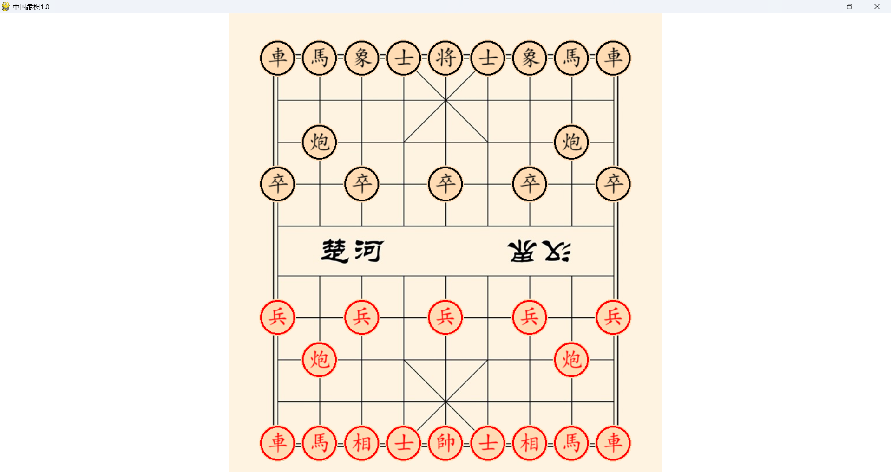

# 中国象棋游戏 - ChessGame
联系方式: liangyuhao20241118@outlook.com

这是一个基于 Python 和 Pygame 的本地象棋对战程序。

---

## 功能特点
- 支持鼠标操作进行人人对弈
- 完整实现象棋规则（车、马、炮、士、象、兵、将）
- 将帅被吃判断胜负（终端输出）

---

## 使用方式

### 安装与运行

#### 1. 环境准备
确保已安装以下依赖：
- Python 3.x ([Python官网](https://www.python.org/))
- 安装 `pygame`：pip install pygame
- 安装 `numpy`：pip install numpy

#### 2. 运行程序
- 进入项目目录并运行主程序：_display.py
- 进入 `SourceCode/` 目录并运行 `_display.py`：

#### 3. 注意事项
- 目前仅支持 Windows 系统。

---

## 截图预览

